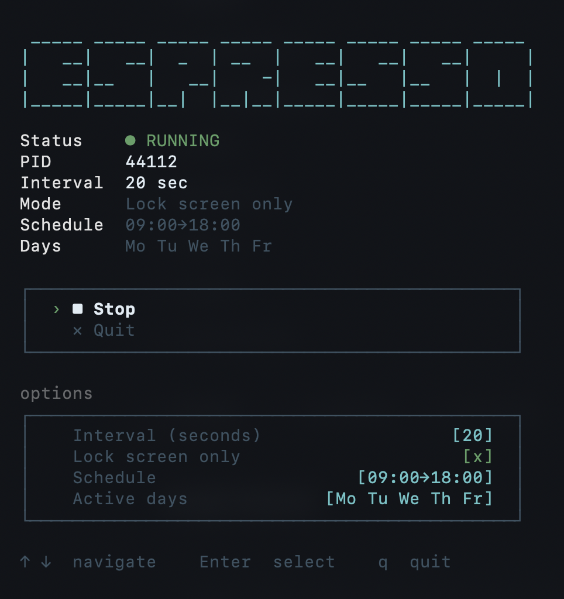

# espresso

```
 _____ _____ _____ _____ _____ _____ _____ _____
|   __|   __|  _  | __  |   __|   __|   __|     |
|   __|__   |   __|    -|   __|__   |__   |  |  |
|_____|_____|__|  |__|__|_____|_____|_____|_____|
```

[](https://github.com/billp/espresso/actions/workflows/ci.yml)
[](LICENSE)


A macOS mouse mover that prevents your screen from sleeping. Runs silently in the background and is managed through an interactive terminal UI.

Unlike `caffeinate`, espresso gives you a live TUI to start/stop the daemon, tune the nudge interval, restrict it to lock-screen-only mode, and schedule it to specific hours and days of the week — all without leaving the terminal.

## Requirements

- macOS
- Python 3 (no third-party packages)

## Install

```bash
curl -fsSL https://raw.githubusercontent.com/billp/espresso/refs/heads/main/install.sh | bash
```

This creates `~/.local/bin/espresso`. If that directory isn't in your `PATH`, add it:

```bash
export PATH="$HOME/.local/bin:$PATH"
```

## Usage

```bash
espresso
```

Navigate with `↑ ↓`, select with `Enter`, quit with `q`.



## Options

| Option | Default | Description |
|---|---|---|
| Interval | 12 sec | Idle time before the mouse nudges (↑↓ ±1 s, ←→ ±10 s) |
| Lock screen only | off | Only move the mouse when the screen is locked |
| Schedule | always | Active time window (e.g. 09:00→18:00) |
| Active days | all | Days of the week the daemon is allowed to run |

The interval is an idle timer: any real mouse or keyboard input restarts it, so espresso never fights you for the cursor. If you grab the mouse mid-nudge, the cycle is abandoned and the cursor stays where you put it.

All settings persist to `~/.config/espresso/config.json` and are restored on next launch. Changing any option while the daemon is running restarts it automatically.

## How it works

The daemon moves the mouse ±5px in a small random jitter pattern and then restores it to the original position. The movement is imperceptible during normal use.

## Development

Source files live in `mmctl/`:

- `mmctl/mm.py` — background daemon (CoreGraphics via ctypes)
- `mmctl/mmctl.py` — interactive TUI manager

After editing either file, regenerate and reinstall:

```bash
python3 build.py   # bumps version, regenerates install.sh
bash install.sh    # installs to ~/.local/bin/espresso
```

---

If espresso is useful to you, consider giving it a ⭐ on GitHub — it helps others find it.
